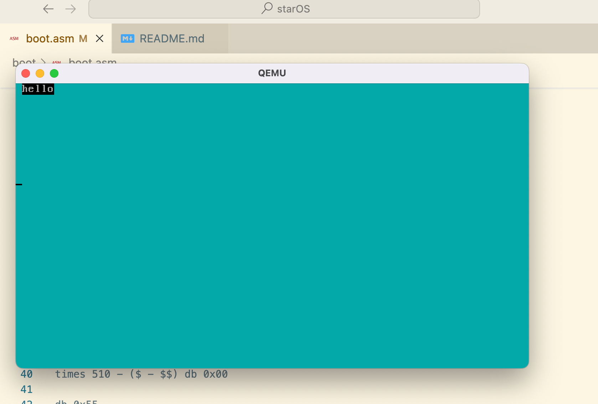
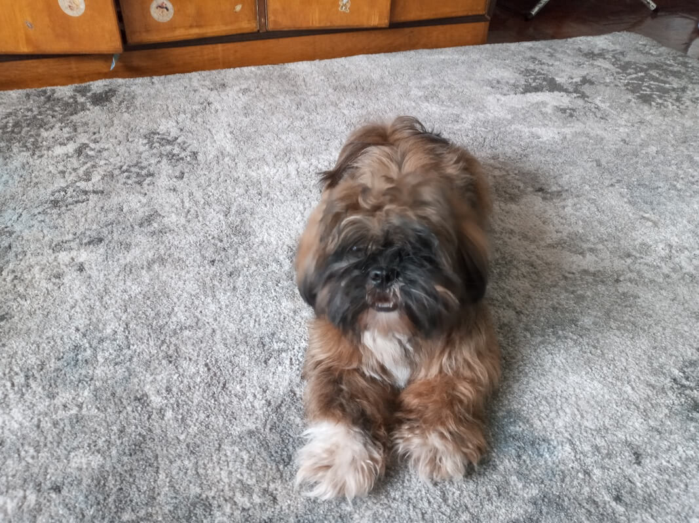

building an OS from scratch

named after [our family doggo](https://xjpa.github.io/star/)

why? to learn

# screenshot

# instructions

1. compile bootloader with nasm
2. compile kernel with gcc
3. link kernel with x86_64-elf-ld
4. convert ELF to binary with x86_64-elf-objcopy
5. cat bootloader and kernel to an OS image
6. run OS: qemu-system-x86_64

going forward, i ought to create a makefile for that

# star

